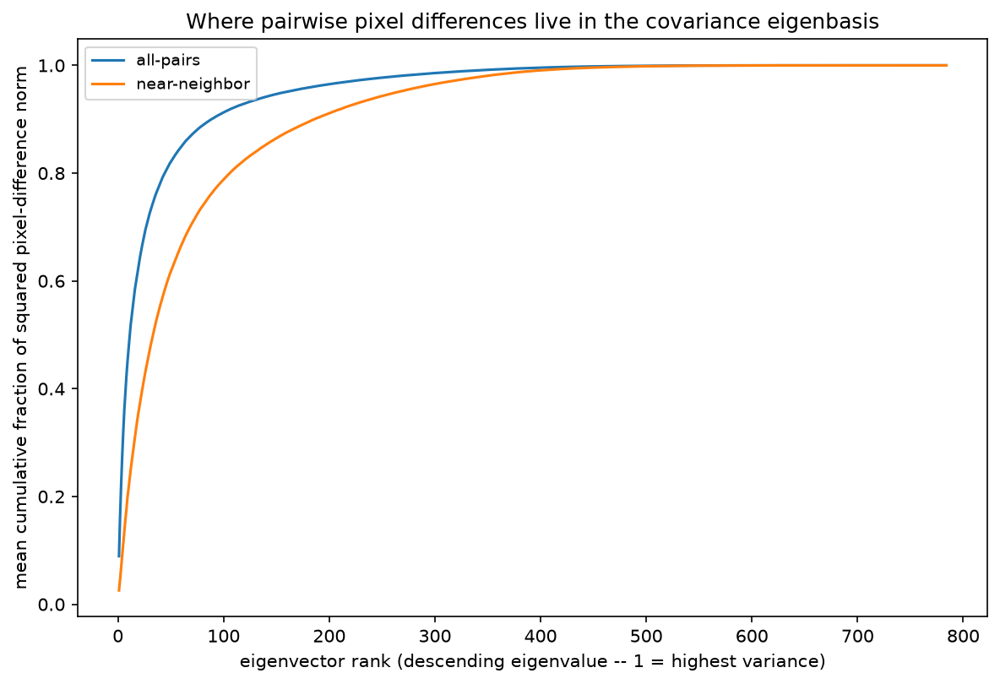

# Why does the Euclidean-vs-Mahalanobis near/all reversal happen? (mechanism confirmed)

Follow-up to an open question flagged in `README.md`'s ratio-distribution section: near-neighbor
pairs sit *above* the all-pairs mean ratio under Euclidean distance, but *below* it under
Mahalanobis distance, for all three original models. The prior text offered a plausible-but-
unchecked explanation; this measures it directly instead.

**Hypothesis being tested**: Mahalanobis distance (with precision `P = Sigma^-1`) amplifies raw
pixel differences along *low-variance* (rare) directions of the data and shrinks them along
*high-variance* (common) directions, since a coordinate's contribution scales as `1/eigenvalue`.
The reversal can only happen if near-neighbor pairs' pixel differences load more heavily on those
low-variance directions than a random pair's differences do — i.e. near-neighbor pairs are close
in raw pixel space specifically *along the common, high-variance directions*, while still
differing by a comparatively larger amount along the rare directions Mahalanobis weights heavily.

**Setup**: logistic regression's already-computed near-neighbor and all-pairs populations
(`results/mnist_experiment_arrays.npz`, `euclidean_logistic_regression_*` — confirmed identical
to the `mahalanobis_logistic_regression_*` arrays' pair indices and subset, since near-neighbor
selection and the stratified subset draw are both metric-independent). No model training —
purely a geometric analysis of the pixel-difference vectors for pairs already selected. Uses the
already-selected `epsilon=0.01` precision matrix (`distance.py::svd_ridge_precision`, same as the
rest of this README).

## Step 1: amplification factor

For every pair in both populations, `amplification_factor = mahalanobis_dist(x_i, x_j) /
euclidean_dist(x_i, x_j)`:

| Population | Mean amplification | Median amplification | Mean Euclidean dist | Mean Mahalanobis dist |
|---|---|---|---|---|
| All-pairs (499,500 pairs) | 2.257 | 2.226 | 10.28 | 22.97 |
| Near-neighbor (5,000 pairs) | 3.299 | 3.236 | 6.16 | 20.01 |

**Near-neighbor pairs are amplified 46.2% more than all-pairs** (3.299 vs. 2.257 mean
amplification). This directly confirms the hypothesis on its own: near-neighbor pairs' pixel
differences get scaled up by Mahalanobis distance substantially more than a random pair's does —
exactly the pattern needed to explain why their *ratio* (margin-diff / distance) falls when the
denominator gets inflated more than average.

## Step 2: where the difference lives in the covariance eigenbasis

Each pair's raw pixel-difference vector `x_i - x_j` was projected onto `svd_ridge_precision`'s
eigenbasis (`V`, sorted by descending eigenvalue — rank 1 = highest variance), computing what
fraction of the squared difference-norm is explained by the top-k eigenvectors, for every k from 1
to 784, averaged per population:



The near-neighbor curve sits below the all-pairs curve at essentially every rank — near-neighbor
differences need more eigenvectors, including lower-variance ones, to explain the same fraction of
their squared norm:

| Rank k | All-pairs cumulative fraction | Near-neighbor cumulative fraction | Gap |
|---|---|---|---|
| 1 | 0.089 | 0.026 | +0.063 |
| 5 | 0.319 | 0.114 | +0.205 |
| 10 | 0.473 | 0.214 | +0.259 |
| 20 | 0.634 | 0.363 | +0.271 (peak) |
| 50 | 0.821 | 0.617 | +0.204 |
| 100 | 0.913 | 0.788 | +0.124 |
| 200 | 0.965 | 0.911 | +0.054 |
| 400 | 0.996 | 0.991 | +0.005 |
| 783 | 1.000 | 1.000 | 0.000 |

Top-50 vs. bottom-50 summary, as originally requested:

| Population | Top-50 fraction (mean) | Bottom-50 fraction (mean) |
|---|---|---|
| All-pairs | 0.8210 | ~3.9e-31 |
| Near-neighbor | 0.6173 | ~6.4e-31 |

**Near-neighbor pairs explain only 61.7% of their squared difference-norm in the top 50 (highest-
variance) directions, versus 82.1% for all-pairs** — a ~20-percentage-point gap, meaning roughly
twice as much of a near-neighbor pair's difference (38.3% vs. 17.9%) sits outside the top-50
highest-variance directions, i.e. spread across the remaining, lower-variance directions.

**Caveat on the literal bottom-50 comparison**: MNIST's pixel covariance has several exactly-zero
eigenvalues (constant-zero border pixels — the same rank-deficiency `distance.py`'s module
docstring documents and the reason `svd_ridge_precision` needs ridge regularization at all). The
bottom 50 of 784 eigenvectors fall in this dead-zero region (`eigenvalues[-1] ≈ 6.1e-34`), where
*no* image varies at all — so both populations' bottom-50 fractions are ~1e-31, floating-point
noise, not a meaningful signal on their own (near-neighbor's is nominally ~1.6x larger, but both
are indistinguishable from zero). The cumulative curve and the top-50-vs-rest split are the
meaningful, robust evidence here; the literal "bottom-50" framing from the original hypothesis
should be read as "outside the top-k for any reasonably small k," not literally the bottom 50 of
784, which is degenerate for this dataset.

## Conclusion: confirmed, not hedged

Both checks agree, and the effect is large, not marginal: near-neighbor pairs' pixel differences
are proportionally weighted more toward low/mid-variance directions and less toward the
highest-variance directions than a random pair's differences are (a ~20-30 percentage-point gap
across most of the spectrum), and this directly produces a 46.2% larger Mahalanobis amplification
factor for near-neighbor pairs specifically. This is sufficient on its own to explain the
Euclidean-vs-Mahalanobis near/all reversal: Mahalanobis distance inflates near-neighbor pairs'
distances disproportionately (relative to all-pairs), which shrinks their ratio
(margin-diff / distance) disproportionately, flipping them from above-average to below-average.
**The hypothesis is confirmed with direct measurement, not left as speculation.**

## Reproducing this

No new permanent driver was added (a one-off mechanism check, matching this project's convention
for `local_patch_cross_terms_euclidean_followup.md`/`label_error_crossref.md`) — `plots.py` gained
one reusable function (`plot_variance_explained_curve`), everything else below is a standalone
script:

```python
import numpy as np
import torch
torch.set_default_dtype(torch.float64)

from mnist_lipschitz.data import load_mnist
from mnist_lipschitz.distance import euclidean_distance_fn, svd_ridge_precision, mahalanobis_distance
from mnist_lipschitz.plots import plot_variance_explained_curve

EPSILON = 0.01  # already-selected epsilon for logistic regression, see README

train = load_mnist(train=True)
test = load_mnist(train=False)

d = np.load("mnist_lipschitz/results/mnist_experiment_arrays.npz")
subset_idx = torch.as_tensor(d["euclidean_logistic_regression_subset_idx"], dtype=torch.long)
all_ii = torch.as_tensor(d["euclidean_logistic_regression_all_pairs_ii"], dtype=torch.long)
all_jj = torch.as_tensor(d["euclidean_logistic_regression_all_pairs_jj"], dtype=torch.long)
near_ii = torch.as_tensor(d["euclidean_logistic_regression_near_neighbor_ii"], dtype=torch.long)
near_jj = torch.as_tensor(d["euclidean_logistic_regression_near_neighbor_jj"], dtype=torch.long)
x_subset = test.x_flat[subset_idx]

# Step 1: amplification factor
precision = svd_ridge_precision(train.x_flat, EPSILON)
def amp_factor(ii, jj):
    xi, xj = x_subset[ii], x_subset[jj]
    euc = euclidean_distance_fn(xi, xj)
    mah = mahalanobis_distance(xi, xj, precision)
    return (mah / euc.clamp_min(1e-12)).mean().item()
print("all-pairs amplification:", amp_factor(all_ii, all_jj))
print("near-neighbor amplification:", amp_factor(near_ii, near_jj))

# Step 2: eigenbasis projection
x_centered = train.x_flat - train.x_flat.mean(dim=0, keepdim=True)
N = train.x_flat.shape[0]
_, S, Vh = torch.linalg.svd(x_centered, full_matrices=False)
V = Vh.T  # (784, 784), columns sorted by descending eigenvalue

def cumulative_fraction_curve(ii, jj, batch_size=20000):
    D = V.shape[0]
    sum_cum_frac = torch.zeros(D)
    for start in range(0, ii.shape[0], batch_size):
        sl = slice(start, min(start + batch_size, ii.shape[0]))
        diff = x_subset[ii[sl]] - x_subset[jj[sl]]
        coeffs = diff @ V
        sq = coeffs**2
        total_sq = sq.sum(dim=-1, keepdim=True).clamp_min(1e-12)
        sum_cum_frac += (torch.cumsum(sq, dim=-1) / total_sq).sum(dim=0)
    return sum_cum_frac / ii.shape[0]

curve_all = cumulative_fraction_curve(all_ii, all_jj)
curve_near = cumulative_fraction_curve(near_ii, near_jj)
plot_variance_explained_curve(curve_all, curve_near, save_path="mahalanobis_flip_variance_explained.png")
```
